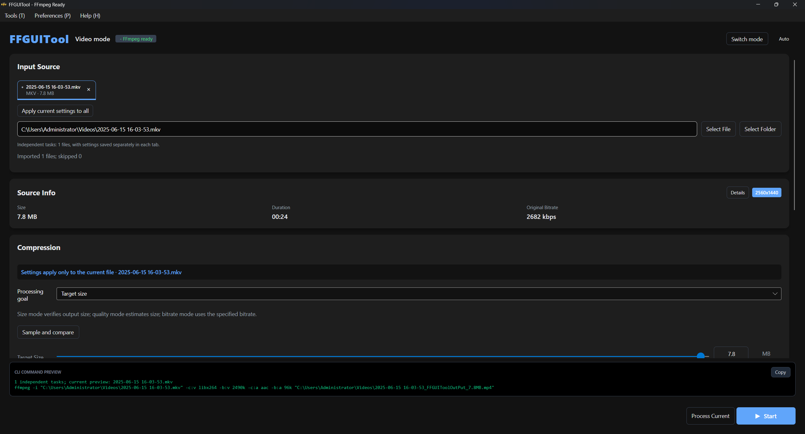

# FFGUITool

[中文](README.zh-CN.md) · [Download](https://github.com/brealinxx/FFGUITool/releases/latest) · [Changelog](CHANGELOG.md)

A cross-platform FFmpeg desktop app for compressing and converting video, audio, and images—without writing commands.



## Unreleased improvements

- Workspace saves use detached snapshots and a background writer; exit waits for the final save.
- Running progress is coalesced, large queue reorders use range updates, and the 512-entry media cache retains recently used files.
- Wide windows show tasks beside settings; narrow windows keep one column. Lists support editing selection and per-file removal; presets and advanced encoding options sit near the parameters.
- Queue restoration retains per-file settings and folder ratios; applying to all files includes the latest slider value, and language changes preserve parameters and task states.
- Release automation checks tag/version agreement; dev and main CI include Windows workspace recovery checks.
- See the [release readiness review](docs/RELEASE_REVIEW.md) for the latest checks and remaining release steps.
- See the [measured performance and verification report](docs/PERFORMANCE.md) for results and remaining work.

## Download and install

Choose your system and architecture from [GitHub Releases](https://github.com/brealinxx/FFGUITool/releases/latest):

| System | Architectures | Packages |
| --- | --- | --- |
| Windows | x64, x86, ARM64 | `.exe` installer or portable `.zip` |
| macOS | Intel, Apple Silicon | `.dmg` or portable `.zip` |
| Linux | x64, ARM64 | Portable `.zip` |

Configure **FFmpeg** on first launch by selecting an existing executable or installing from an archive. ffprobe is recommended; ExifTool is optional for metadata inspection and removal.

## Features

- **Compress and convert** by target size, quality, or bitrate, with trimming, resizing, audio extraction, and stream copy for compatible formats.
- **Independent files and folder batches**: each imported file keeps its settings; folder tasks share settings. Includes subfolder scanning, search, failure filtering, and sorting.
- **Samples and presets**: compare short video samples or images, save presets, review history, and reuse settings.
- **Output protection**: customize names and subfolders, preserve previous outputs when encoding fails or is cancelled, and retry failed tasks.
- **Convenient interface**: Chinese/English, light/dark themes, optional tray mode, and a copyable CLI command preview.

Common formats include MP4, MKV, WebM, MOV, MP3, WAV, FLAC, JPG, PNG, WebP, and ICO. Available encoders depend on the FFmpeg build and your device.

## Quick start

1. Choose **Video mode** (also handles audio) or **Image mode**.
2. Drop files or select a folder. Check the import count and reasons for skipped entries.
3. Choose the processing goal, size/quality, and output format. The editor identifies whether settings apply to the current file or the whole folder.
4. Select the destination and naming rules under **Output settings**. Use **Sample and compare** if needed.
5. Process the current file or all tasks, then open outputs from **Results**.

Use **Apply current settings to all** to copy settings across independent files. **Preferences → Application settings** controls tray behavior and image concurrency; these settings save automatically and remain independent of presets.

Shortcuts: `Ctrl+O` import · `Ctrl+Enter` process · `Escape` cancel.

## Things to know

- Images and video/audio are filtered by the current mode; there is no unified mixed-media queue. Import folders separately.
- A target size may be unattainable; oversized outputs receive a warning. Images are resized to meet a target only when explicitly allowed.
- Video samples cover up to 10 seconds and cannot accurately predict whole-file size. Restored unfinished tasks restart from the beginning.
- Hardware encoding depends on the device and drivers. Two-pass encoding is limited to compatible software H.264/VP9 bitrate modes.
- Animated images export only the first frame in the still-image workflow. HDR-to-SDR conversion is not automatic; check a sample first.

## Development

Requires the .NET 8 SDK; media processing and integration tests also require FFmpeg.

```bash
dotnet restore FFGUIToolAvalonia.sln
dotnet run --project FFGUITool/FFGUITool.csproj
```

See the [development and release guide](docs/DEVELOPMENT.md) for tests, the 1,000-file UI check, and packaging. Current portable naming example: `FFGUITool-v1.10.0-<platform>-Portable.zip`.

## License

See [LICENSE](LICENSE).
